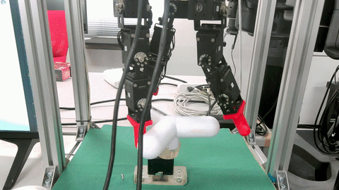

# Demonstration



# How to use?
```python
from webcam_control import WebCamControl

if __name__ == '__main__':
    # test usecase
    webcam = WebCamControl(cam_id=1)
    webcam.rec_start('./test_video_front.mp4')
    # -------
    for i in range(30):
        # Do somthing...
        time.sleep(0.1)
        # Do somthing...
    # -------
    webcam.rec_stop()
    webcam.release()

```

